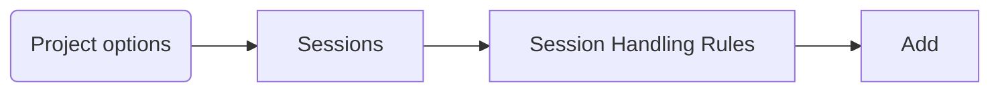
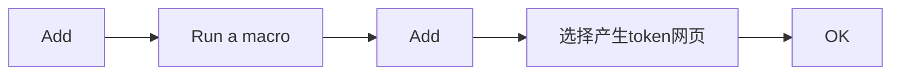
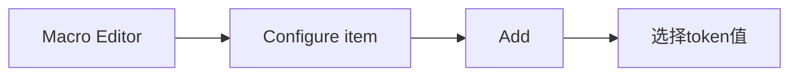
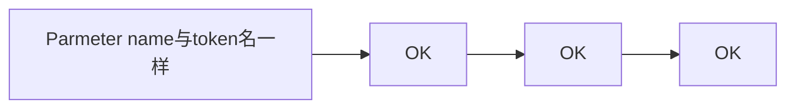
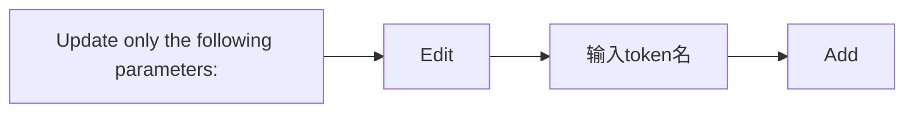
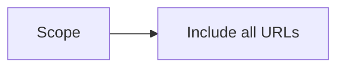

## Token

```mermaid
graph LR
	A(Project options) --> B[Sessions] --> C[Session Handling Rules] --> D[Add]
	
```

```mermaid
graph LR
A[Add] -->B[Run a macro] --> C[Add] --> D[选择产生token网页] --> E[OK]
```

```mermaid
graph LR
A[Macro Editor] --> B[Configure item] -->C[Add] -->D[选择token值]
```

```mermaid
graph LR
A[Parmeter name与token名一样] --> B[OK] -->C[OK] --> D[OK]
```

```mermaid
graph LR
A[Update only the following parameters:] --> B[Edit] --> C[输入token名] --> D[Add]
```

```mermaid
graph LR
A[Scope] --> B[Include all URLs]
```
